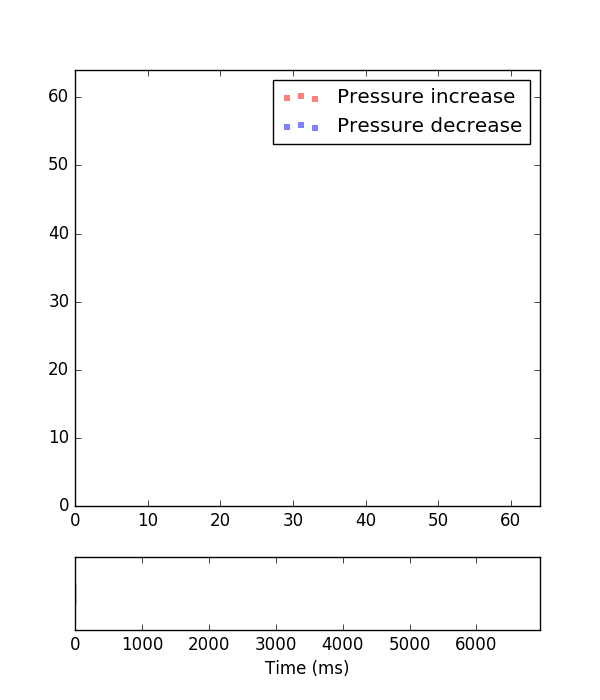

## Tactile signature identification and verification

Part of the [2016 Telluride Neuromorphic Cognition Engineering Workshop](http://telluride.iniforum.ch/).

Tactile signatures were collected from 11 participants. Signatures were recorded on a 64x64 tactile array. Each signature consists of a sequence of tactile events. Each event is a 4-tuple, comprised of a timestamp, x and y coordinates, and type of event (pressure increase or decrease).

<div align="center">
  
</div>

Identification and verification results were obtained with the partially observable hidden Markov model (POHMM), using the [pohmm](https://github.com/vmonaco/pohmm) python package. Parameters are conditioned on the event polarity (pressure increase or decrease). Features include the time interval and motion in the x and y direction. The time interval is modelled by a lognormal distribution and motion by a normal distribution.

## Requirements

Results were obtained with the following software:

```
> watermark -v -p numpy,pandas,scikit-learn,pohmm
CPython 3.5.1
IPython 4.1.2

numpy 1.10.4
pandas 0.18.0
scikit-learn 0.17.1
pohmm 0.2
```

To reproduce the experimental results, run

    $ python classify.py data_dir
    
where `data_dir` is the location of the tactile samples. 

## Experimental results

### Identification

Using the genuine samples only, the first trial is used to determine model parameters. The remaining 9 trials of each user are then classified by choosing the maximum likelihood model. This is a one-shot learning scenario since only one trial is used for training.

    One-shot identification ACC: 71.30 %

Ignoring the event polarities (pressure increase or decrease), identification results are obtained using a traditional hidden Markov model.

    HMM one-shot identification ACC: 56.48 %

Increasing the number of training samples to 5 improve identification accuracy slightly. For each user, the first 5 trials are used for training and the remaining 5 samples for testing.
    
    Train 5 identification ACC: 78.33 %

### Verification

Verification results are obtained in the usual way. Model parameters are determined by the first trial of each user. The receiver operating characteristic (ROC) curve is derived from the remaining 9 genuine samples and 10 impostor samples. Scores are given by the normalized loglikelihood. The equal error rate (EER) is determined for each user, and the mean EER is reported as verification performance.

    Verification EER: 0.11 +/- 0.22 %

An open system can also be designed, in which the genuine/impostor users do not appear in the training data. This scenario is the most difficult, since the model must capture general differences between genuine and impostor samples. Training data consist of genuine and impostor samples from every user except the target user. Genuine samples from the target user of the impostor samples are also left out of the training set (so that neither the test user or either of the test signatures appears in the training set). Classification accuracy is determined by the genuine and impostor samples for the target user, choosing the model (either genuine or impostor) with the highest likelihood. 

    Zero-shot verification ACC: 72.60 %
